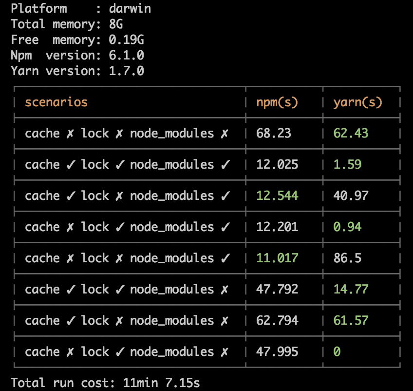

# perf-npm5-vs-yarn
> A performance test project for npm@5.x vs yarn.

To use `npm@5.x` or `yarn`? Maybe you can get your answer from this project.

## Usage
First of all, you should install `npm` and `yarn` globally.

Then, you should install [colors](https://www.npmjs.com/package/colors) and [cli-table](https://www.npmjs.com/package/cli-table)  *globally* to print friendly log:
```bash
# or use yarn to install
npm i colors cli-table -g
```
Then run the performance test:
```
npm start
```

It will finally print a result table like this:



Note: The result may be different in different environments.

We do the comparison in 8 scenarios, the result with green font in every scenario means the faster one.


## Registry
You can modify the test registry in `package.json`, filed `perfConfig.registry`. Default is `https://registry.npm.taobao.org`.

## Test packages
You can modify the test packages in `package.json`. Default is a series of packages initiallized by [vue-cli](https://www.npmjs.com/package/vue-cli).

## How does it work
It use Node.js internal module `child_process` to run command to control the whole process. Every command is executed one by one with `Promise`.

## Notice
The result time for every installation is read from the stdout extracted by `/in\s+([0-9\.]+)s\.?\n$/`, which means the result time is supplied by `npm` or `yarn` itself.

If we count the time outside the installation, there is always some delay against the inside result. So we use the inside time as the result.